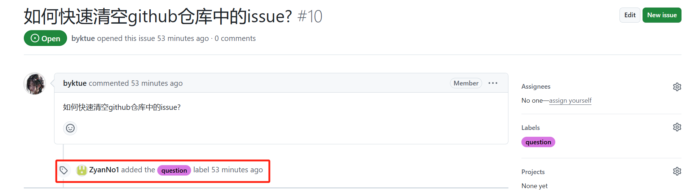
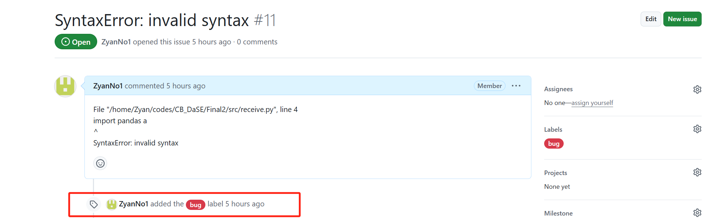
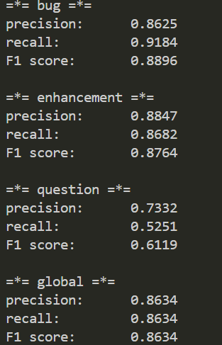

# Issue_label_bot

本项目基于 [RoBERTa-base](https://huggingface.co/FacebookAI/roberta-base)模型 和 Flask架构 实现仓库中issue的自动分类。

目前该bot可以识别三类：`bug`，`enhancement`和`question`，如果在仓库中有属于这三类的issue就会被自动打上标签。

效果如下图（更详细演示内容可见 [PPT](https://github.com/teamkongju/kongju/blob/main/%E5%A4%8D%E8%B5%9B/issue%E6%96%87%E6%9C%AC%E8%AF%86%E5%88%AB%E5%88%86%E7%B1%BB%EF%BC%88%E5%A4%8D%E8%B5%9B%EF%BC%89.pptx)）：



**如果issue不属于三类中的任何一类，将不会被打上标签*<br>
**演示使用*[@ZyanNo1](https://github.com/ZyanNo1)*的Github令牌，挂载本项目的仓库；本地服务器已关闭*
## 项目特点
1. **自动化处理 GitHub Issue** ：
通过机器学习模型RoBERTa，自动化分类和标记 GitHub Issue，使得项目管理更加高效。

2. **特征提取** ：
自定义特征，将`is_early_issue`、`is_opened_owner` 和 `is_question` 编码为模型输入特征，而非单从`issue_title`和`issue_text`的编码判断。多维度的特征充分利用了数据，提高了模型的预测准确性。

3. **训练数据灵活** ：
项目内置了诸如`create_modified_dataset` 等数据处理函数，能够灵活处理训练数据集。使用者只需对原始数据进行简单处理，即可将其用作模型的训练数据。这使得分类器可以持续优化和改进，适应更多的场景，拓展性高。

4. **实时响应**：
通过集成 Flask 和 GitHub Webhooks，系统可以实时响应并处理新的 Issue。这种实时性为项目管理提供了及时的反馈和处理。

## 关于模型
RoBERTa-base 是一种基于 Transformer 架构的自然语言处理预训练模型，由Facebook AI 提出，作为BERT模型的改进型，使用了更大更丰富的语料作为训练集，学习迁移能力强，对于文本分类、问答系统等任务有着很好的表现。


我们对RoBERTa-base模型进行了微调，并使用近98万条数据进行定制化训练，保证对issue分类有更优的表现。

我们通过解析issue的url，将`is_early_issue`, `is_opened_owner`和 `is_question`作为`features`,`issue_title`和`issue_text`拼接编码后作为`encodings`，与`label`一起作为训练集再次训练（详见`src/utils.py`中相关函数）。

模型训练后各分类表现如下图：




原始模型更多信息详见：
- **RoBERTa**: Liu, Y., Ott, M., Goyal, N., Du, J., Joshi, M., Chen, D., Levy, O., Lewis, M., Zettlemoyer, L., & Stoyanov, V. (2019). [*RoBERTa: A Robustly Optimized BERT Pretraining Approach*. arXiv.](https://arxiv.org/abs/1907.11692)
- **BERT**: Devlin, J., Chang, M. W., Lee, K., & Toutanova, K. (2018). [*BERT: Pre-training of Deep Bidirectional Transformers for Language Understanding*. arXiv.](https://arxiv.org/abs/1810.04805)
## 数据集
数据来源于 OpenDigger的[示例数据](https://xlab2017.yuque.com/staff-kbz9wp/olpzth/tq36xvyzg9b880hy?singleDoc#) 、和 Ticket-tagger的[开放数据](https://tickettagger.blob.core.windows.net/datasets/github-labels-top3-803k-$split.tar.gz)，经过清洗和格式化后形成训练集 [下载连接](https://pan.baidu.com/s/16YypKD5hT_YamUjnShUbUg?pwd=1230)

数据集中三类issue的占比如下：

    Type           %
    bug            0.518565
    enhancement    0.354249
    question       0.127187

数据集格式：

    issue_url                   object
    issue_label                 object
    issue_created_at            object
    issue_author_association    object
    repository_url              object
    issue_title                 object
    issue_body                  object

## 本地部署
**以linux环境为例* 
### 准备工作
1. 安装依赖项
 ```
 pip install -r requirements.txt
 ```
2. 下载预训练的[RoBERTa-base](https://huggingface.co/FacebookAI/roberta-base)模型，并放入 `/root/.cache/huggingface/transformers`  [下载链接](https://huggingface.co/FacebookAI/roberta-base)

3. 将定制化训练后的模型放入`./data/save`中 [下载链接](https://pan.baidu.com/s/1q548GIkqANeqidolKCGSpA?pwd=1230) ( *如果要自行训练可跳过* )

### 数据预处理
**非必须，可直接使用我们已训练好的模型*
1. 下载训练数据集`train.csv`[下载连接](https://pan.baidu.com/s/16YypKD5hT_YamUjnShUbUg?pwd=1230)并放入`./data`

2. 运行`./src/data_split.ipynb`，预览并分割数据集为训练集和验证集

### 模型训练
**非必须，可直接使用我们已训练好的模型*
 ```
    python src/train.py --DATASET_SUFFIX _dropfeature --MODEL_NAME roberta --EMB_MODEL_CHECKPOINT roberta-base --device gpu
 ```
- 如果没有gpu请改为`--device cpu`。更多参数定义及调整详见`./src/config.py`。为了保证训练效率和减少I/O时间，训练检查点为每10000个iter一次，推荐在有GPU且可长时间运行的设备上训练。作者5个epoch跑了25h+

- 训练过程使用了wandb记录，方便跟踪训练效果及设备状态，需要在wandb官网上注册并创建日志文件夹，在linux中提前登录。
- 可使用 以下命令 用测试集对模型准确性进行评估。下载[测试集](https://pan.baidu.com/s/1KzC6BX8IZoO3rpZjKfGFZA?pwd=1230)，并放入`./data` [测试集下载链接](https://pan.baidu.com/s/1KzC6BX8IZoO3rpZjKfGFZA?pwd=1230)
 ``` 
    python src/evaluate.py --DATASET_SUFFIX _dropfeature --MODEL_NAME roberta --EMB_MODEL_CHECKPOINT roberta-base --device gpu
 ```
 

### 后端服务器部署
**这里采用 本地Flask 和 ngork 作为服务器，也可以在云服务器部署*
1. 在ngork官网上注册并申请一个固定的域名，并编辑`root/.config/ngork/ngrok.yml`为以下格式：
 ```
 version: "3"
agent:
    authtoken: YOUR_AUTHTOKEN #你的ngork令牌
tunnels:
  YOUR_TUNNEL_NAME: #你的隧道名
    proto: http
    addr: 5000 #你的端口号
    hostname: YOUR_DOMAIN #你申请的ngork域名
 ```
2. 在`./src/receive.py` `line28`中设置 置信度阈值`confidence_threshold` (默认为0.6)

3. 使用已有的Github账号或新注册账号，在`Settings`中的`Developer Settings`中申请`Personal access token`(`Select scopes`必须勾选`repo`，其他任意)，并把这个token复制到`./src/receive.py` `line38`中：
 ```python
 headers = { 
            "Authorization": f"token YOUR_ACCESS_TOKEN", #替换成你的令牌
            "Content-Type": "application/json" 
        }
 ```

4. 在Terminal中输入:
```
    python src/receive.py
```

5. 在新的Terminal里输入：
 ```
    ngrok start YOUR_TUNNEL_NAME
 ```
 
 - `YOUR_TUNNEL_NAME`改为你的隧道名。
 - 应该能看到ngork的运行信息， `Session Status`为`online`则本地服务器暴露成功。

### 挂载仓库
1. 进入你想实现issue自动分类的仓库，点击仓库页面顶部的 `Settings`

2. 在左侧菜单中点击`Webhooks`，点击`Add webhook`

3. 在`Payload URL`填写`https://YOUR_DOMAIN/predict`，`YOUR_DOMAIN`改成你申请的域名

4. `Content type`选择`application/json`

5. 在 “Which events would you like to trigger this webhook?” 中选择 `Let me select individual events` 并勾选 `Issues`

6. 点击`Add webhook`，设置完毕

## 项目展望
* **在更大的数据集上训练** 现在三类issue的数据量比较悬殊，question类的训练较为缺乏，识别还不够准确。由于设备和时间的限制，只能在现在大小的数据集上训练，对于模型的定制化训练程度有限，未来可在更大的数据集上进行更深度的训练。

* **实现更多类型的分类** 由于时间原因，该项目目前只能实现三个类别的issue分类。但是由于RoBERTa模型的高拓展性，在有充分数据集的支持下，完全可以实现更多类型的准确识别。
  
* **支持多语种识别** 现在主要是在英文的数据集上进行训练，对于其他语言的识别能力有限，未来可进行进一步开发
  
* **采用性能更好的预训练模型** 可以使用RoBERTa-large替换现有的RoBERTa-base。

* **使用更稳定的后端服务器** 将bot部署到有公网ip的云服务器上

## 成员分工
- [@ZyanNo1](https://github.com/ZyanNo1)李则言：本地模型部署、模型训练、后端服务器部署、文档撰写
- [@byktue](https://github.com/byktue)      杨金辉：数据采集处理、仓库挂载、仓库管理、PPT制作
  
## 参考资料
* Hugging Face 有关于 RoBERTa模型 无比详尽的 [tutorial document](https://huggingface.co/FacebookAI/roberta-base)
* RUNOOB.com 有关于 Flask 的 [入门教程](https://www.runoob.com/flask/flask-router.html)
* Ngork 有关于 内网暴露 的 [tutorial document](https://ngrok.com/docs/)
* OpenDigger 的 [用户文档](https://github.com/X-lab2017/open-digger-website/tree/master/docs/user_docs) 以及 [示例数据](https://xlab2017.yuque.com/staff-kbz9wp/olpzth/tq36xvyzg9b880hy?singleDoc#)
* Kadam-Tushar 的 Github开源项目 [issue-classifier](https://github.com/Kadam-Tushar/Issue-Classifier)
